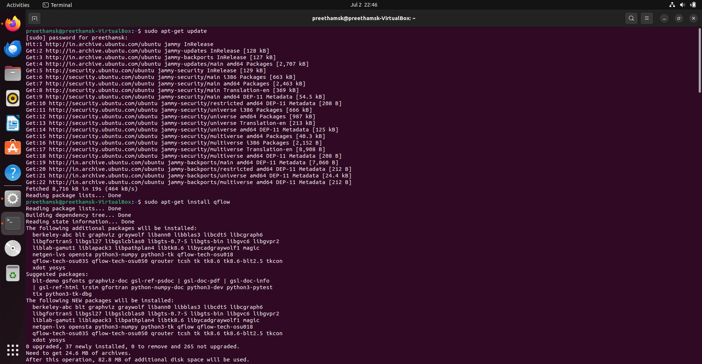
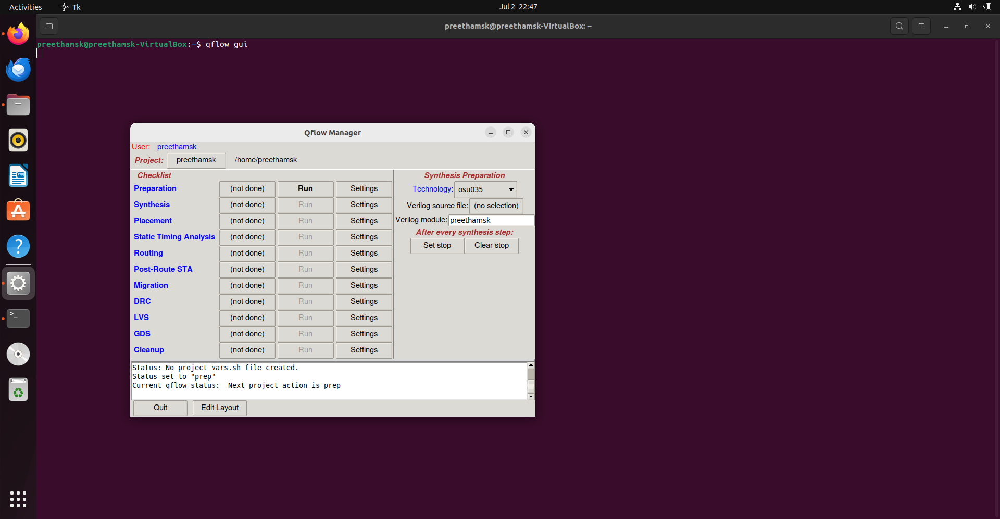

# Tool Setup & Invocation
> Qflow Installation, Project Configuration & GUI Launch

<h2>🔍 Overview</h2>

- Installed the complete Qflow open-source EDA toolchain on Ubuntu Linux via `sudo apt-get install qflow` — automatically resolving all dependencies including Yosys, Graywolf, Qrouter, Magic, Netgen, Vesta, and OSU technology libraries.
- Configured the project directory with OSU018 as the target technology library, set `spi_top.v` as the Verilog source module, and successfully launched the Qflow Manager GUI using `qflow gui` — verifying all checklist stages were visible and ready for execution.

<h2>⚙️ Tasks Covered</h2>

| Task | Description |
|:---|:---|
| Qflow Installation | `sudo apt-get install qflow` — all dependencies resolved |
| Project Configuration | Technology: osu018, Source: spi_top.v, Module: spi_top |
| GUI Launch | `qflow gui` — Qflow Manager launched with full checklist |

<h2>📝 Stage Details</h2>

**Task 1 — Qflow Installation** &nbsp;|&nbsp; `apt-get` `Ubuntu` `Dependencies`

Opened the Ubuntu terminal and ran `sudo apt-get update` followed by `sudo apt-get install qflow`. The package manager automatically resolved and installed all 37 required packages — including Yosys, Graywolf, Qrouter, Magic 8.3, Netgen, Vesta, OSU035 and OSU018 technology libraries, Python3, Tcl/Tk, and graphviz. Total installation size: 82.8 MB.

**Task 2 — Project Configuration & GUI Launch** &nbsp;|&nbsp; `qflow gui` `osu018` `spi_top`

Launched the Qflow Manager GUI using the `qflow gui` command from the terminal. Configured the project with:
- **Technology:** osu018 (0.18 µm standard cell library)
- **Verilog source file:** spi_top.v
- **Verilog module:** spi_top

Verified the complete Qflow checklist — Preparation, Synthesis, Placement, Static Timing Analysis, Routing, Post-Route STA, Migration, DRC, LVS, GDS, and Cleanup — all visible and ready for sequential execution.

<h2>🖼️ Implementation Results</h2>

### Opening the Terminal

### Command for Invoking the Tool

### Invoking the Tool — Qflow Manager GUI

<h2>🔗 Navigation</h2>

[Back to Repository Overview](../README.md) &nbsp;|&nbsp; [Next : 02 : Synthesis](../02%20:%20Synthesis/README.md)
